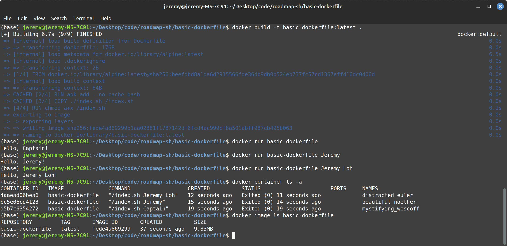

# Basic Dockerfile

Build a basic Dockerfile to create a Docker image.

Write a basic Dockerfile to create a Docker image. When this Docker image is run, it should print “Hello, Captain!” to the console before exiting

The more "advanced" version is completed for this repository

1. `bash` is installed using `RUN`
2. The `index.sh` script file is copied over to `/` using `COPY`
3. `chmod` is done to add execute permission for the `index.sh` using `RUN`
4. The script file uses `$@` to get passed arguments

# Requirements

- The Dockerfile should be named Dockerfile.
- The Dockerfile should be in the root directory of the project.
- The base image should be alpine:latest.
- The Dockerfile should contain a single instruction to print “Hello, Captain!” to the console before exiting.

If you are looking to build a more advanced version of this project, you can consider adding the ability to pass your name to the Docker image as an argument, and have the Docker image print “Hello, [your name]!” instead of “Hello, Captain!”.

https://docs.docker.com/reference/dockerfile/

# Creating docker image and running container

1. Install docker and navigate to this directory (where `Dockerfile` is present)
2. Build the docker image using `docker build -t basic-dockerfile:latest .` (`.` is for current directory)
3. Create and run the container based on built image using `docker run basic-dockerfile:latest`



# Removing images

1. Find the container id using `docker container ls -a`
2. Delete the container using `docker container rm <container_id>` (or use `docker container prune` to delete all stopped containers)
3. Delete the created image using `docker image rm <image_name:tag>`

Or `docker system prune`

```shell
WARNING! This will remove:
  - all stopped containers
  - all networks not used by at least one container
  - all dangling images
  - unused build cache
```

# References

1. alpine based linux does not have `/bin/bash` - https://stackoverflow.com/questions/40944479/docker-how-to-use-bash-with-an-alpine-based-docker-image
2. Docker ENTRYPOINT vs CMD - https://www.youtube.com/watch?v=R0toi5gaYbc

   - CMD can be overriden if arguments are given to `docker run <image>`
   - ENTRYPOINT value are not overriden
   - ENTRYPOINT will be run with values from CMD (if nothing else is provided), else it will pass the CLI arguments to ENTRYPOINT!
   - Will not append if using shell syntax (e.g. `ENTRYPOINT echo`). Need to use `ENTRYPOINT ["echo"]`
   - e.g.

   ```dockerfile
   FROM alpine:latest
   ENTRYPOINT [ "echo", "Hello," ]
   CMD ["Captain!"]
   ```

3. What does `$@` mean in a shell script - https://stackoverflow.com/questions/9994295/what-does-mean-in-a-shell-script

https://roadmap.sh/projects/basic-dockerfile
